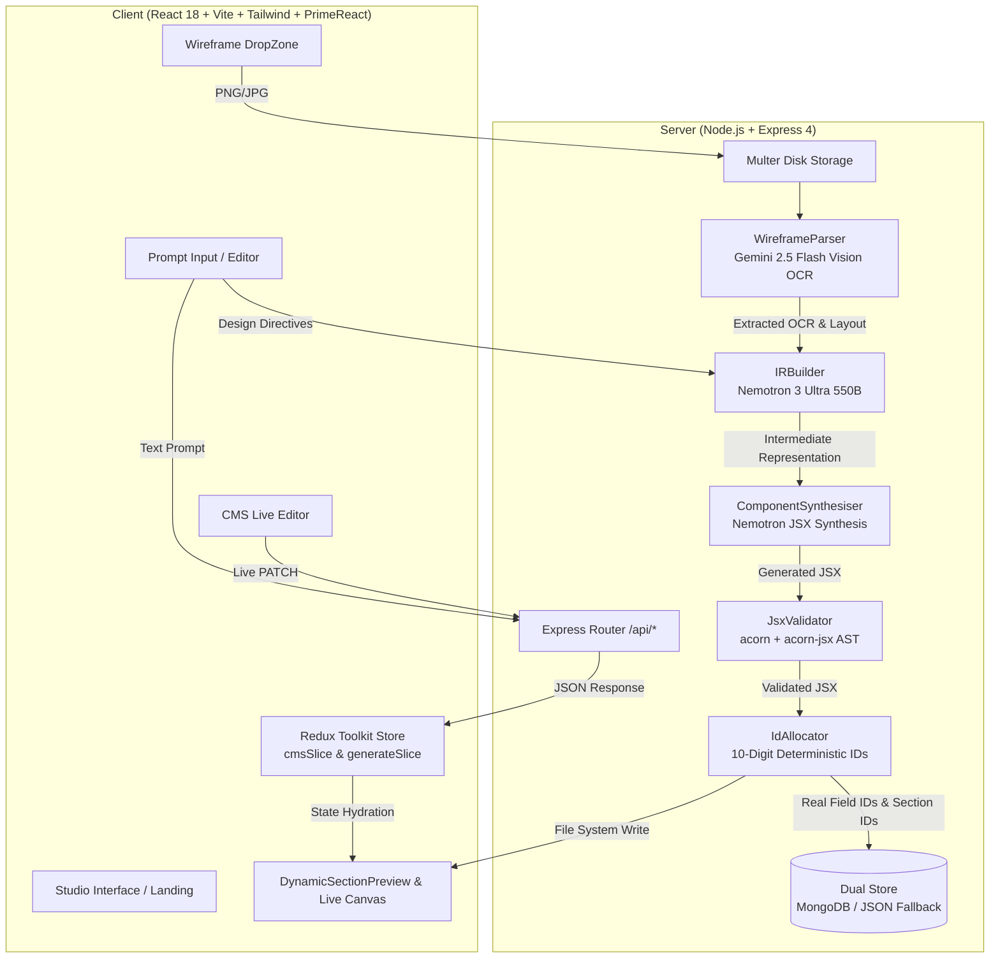

# ✦ System Architecture & Design Specification

This document details the architectural foundation, data flow pipelines, and technical contracts powering the **AI-Assisted UI Generation Studio**.

---

## 🏗️ 1. High-Level System Architecture

---

## ⚡ 2. Dual-AI Pipeline Mechanics

### Phase 1: Spatial Vision & OCR Extraction
- **Model**: `gemini-2.5-flash` via `@google/generative-ai`
- **Responsibility**:
  1. Full OCR transcription of headlines, brand text, subheadings, paragraphs, buttons, and stat counters.
  2. Spatial layout detection: flex direction (`row` vs `column`), media position (`left`, `right`, `top`, `none`), and grid columns.
  3. Color theme extraction: primary accent colors, dark vs light background.

### Phase 2: Intermediate Representation (IR) Normalization
- **Model**: `nvidia/nemotron-3-ultra-550b-a55b` via OpenRouter
- **Responsibility**:
  - Merges vision OCR, natural language prompt instructions, and existing code AST into a normalized schema.
  - Generates stable semantic element nodes using placeholder IDs (`TBD-headlineMain`, `TBD-cardField1`, etc.).
  - Priority Resolution: **Prompt** wins for copy & accent colors; **Wireframe** wins for spatial geometry; **Code** wins for preserving existing field IDs.

### Phase 3: JSX Component Synthesis & AST Validation
- **Model**: `nvidia/nemotron-3-ultra-550b-a55b` (`temperature: 0.2`, `max_tokens: 2500`)
- **Validation**: AST walker using `acorn` + `acorn-jsx` parses synthesized code to guarantee syntax compilation.
- **Fail-Safe**: If double synthesis fails, the system executes an automated fallback synthesis matching the exact IR tokens.

### Phase 4: Deterministic 10-Digit ID Allocation
- **Allocator**: `IdAllocator.js` with persistent atomic counter (`id-counter.json`).
- Allocates strictly compliant 10-digit IDs:
  - Sections: `1000000001+`
  - Elements: `2000000001+`
  - Card pairs: `3000000001+`
- Replaces all `TBD-` placeholders in JSX and database records.

---

## 📜 3. Mandatory Contract Rules (R1–R14)

Every synthesized React component strictly adheres to 14 engineering constraints:

| Rule | Description | Implementation Pattern |
| :--- | :--- | :--- |
| **R1** | Stable IDs Map | `const ids = { heroImage: "2000000...", ... };` |
| **R2** | Page Name Prop | `const CustomSection = ({ pageName = "Home" }) => { ... }` |
| **R3** | Redux Mount Hydration | `dispatch(fetchElementsByIds({ elementIds: [...], pageName }));` |
| **R4** | Redux State Selectors | `useSelector(state => state.cms?.allSections?.[pageName]);` |
| **R5** | Direct DOM IDs | `id={ids.headlineMain}` or `id={item.fieldId1}` on every node |
| **R6** | Safe HTML Rendering | `dangerouslySetInnerHTML={{ __html: data?.[ids.xxx] \|\| fallback }}` |
| **R7** | Dynamic Image Helper | `` |
| **R8** | PrimeReact Button | `<Button id={ids.ctaButton} label={data?.[ids.ctaButton]} />` |
| **R9** | Cards Loop Pattern | `statBadgesArr.map(item => 
...
)` |
| **R10**| Dynamic CSS Overrides | `useEffect(() => { el.style.cssText = cssData[id]; }, [cssData]);` |
| **R11**| Mobile-First Responsive Architecture | Full mobile-first stacking (`flex-col lg:flex-row`), root `w-full overflow-x-hidden`, responsive padding (`px-3 sm:px-8 lg:px-16 py-6 sm:py-8 lg:py-12`), responsive typography with `break-words`, mobile 2x2 photo galleries (`grid-cols-2 gap-2 sm:gap-4`), swipeable swatches with `overflow-x-auto no-scrollbar flex-shrink-0`, 7-size selectors (`grid-cols-4 sm:grid-cols-7 gap-1.5 sm:gap-2`), 48px+ touch targets (`flex-1 py-3.5 sm:py-4`, `flex-shrink-0 w-12 h-12 sm:w-14 sm:h-14`), and sticky mobile navigation. |
| **R12**| Inspection Classes | `className="dynamicStyle"` and `className="dynamicStyle2"` |
| **R13**| No Hardcoded Secrets | Uses `import.meta.env.VITE_*` exclusively |
| **R14**| Standard Module Export | `export default CustomSection;` |

---

## 🎨 4. iOS 26 Glassmorphic Design System

The frontend implements an ultra-modern iOS 26 visual language:
- **Canvas Base**: Ultra-dark `#09090b` (zinc-950).
- **Glass Surfaces**: `rgba(255, 255, 255, 0.06)` with `backdrop-filter: blur(24px)` and `1px solid rgba(255, 255, 255, 0.1)`.
- **Gradients**: Red-to-Orange dynamic energetic highlights (`#ef4444` to `#f97316`).
- **Typography**: Apple SF Pro Display typography hierarchy with system fallbacks.
- **Controls**: Pill-shaped action capsules with shimmer animations (`rounded-full`).

---

## 📱 5. Mobile-First Responsive Architecture & Viewport System

To guarantee that AI-generated UI renders flawlessly across both small mobile displays (down to 375px iPhone width) and ultra-wide desktop monitors (1920px+), the generator enforces a strict mobile-first architecture:

### 1. Structural Fluidity & Layout Stacking
- **Mobile Stacking**: Mobile viewports default to `flex flex-col` where gallery/media and product specifications stack vertically in natural scroll flow.
- **Desktop Expansion**: Transitions dynamically at `lg:` breakpoints to multi-column splits (`lg:flex-row`, `lg:w-7/12` gallery, `lg:w-5/12` content).
- **Zero Horizontal Overflow**: Root containers specify `w-full overflow-x-hidden` with adaptive padding (`px-3 sm:px-8 lg:px-16 py-6 sm:py-8 lg:py-12`).

### 2. Adaptive Typography & Media Galleries
- **Responsive Typography**: Major headlines combine fluid typography with word-breaking: `text-2xl sm:text-3xl md:text-4xl xl:text-5xl font-black break-words tracking-tight`. Subheads scale smoothly via `text-lg sm:text-xl md:text-2xl`.
- **2x2 Product View Grids**: 4-angle product photo galleries render as compact, high-density grids: `grid-cols-2 gap-2 sm:gap-4` with badges sized `text-[9px] sm:text-[10px]`.

### 3. Touch Targets & Ergonomics
- **Horizontal Swatch Carousels**: Color swatches are wrapped in `flex items-center gap-2 sm:gap-3 overflow-x-auto pb-1 no-scrollbar` with `flex-shrink-0 w-9 h-9 sm:w-10 sm:h-10` to prevent button squashing.
- **7-Column Size Selector**: Compact grid `grid-cols-4 sm:grid-cols-7 gap-1.5 sm:gap-2` with `py-2 sm:py-2.5 text-xs sm:text-sm` ensuring all 7 sizes fit on screen without vertical staggering.
- **Touch Targets**: CTAs feature minimum 44px–56px touch height (`py-3.5 sm:py-4`) and icon buttons use `flex-shrink-0 w-12 h-12 sm:w-14 sm:h-14` preserving circular geometry.

### 4. Studio Preview Responsive Top Bar & Drawer
- **Responsive Navigation**: Mode buttons condense text on mobile screens (`🖥️ Preview`, `🌓 Split`, `💻 Code`) and hide secondary descriptors.
- **Mobile CMS Drawer**: When opened on mobile devices, the CMS Editor behaves as a smooth backdrop-blurred drawer overlay (`fixed inset-y-16 right-0 w-80 z-40`), preventing the preview canvas from being compressed.
- **Dual Viewport Switcher**: Quickly test components between simulated **📱 375px Mobile (iPhone SE)** and **💻 1280px Desktop** with one click.

